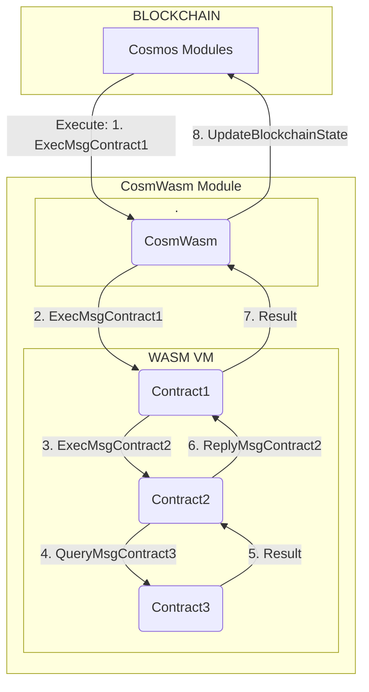

# Sylvia introduction

## 1. Before Sylvia
Example of a single transaction in **CosmWasm** ecosystem (highlevel diagram):

## 2. Goals of Sylvia
1. Sylvia auto-generates:
    * Structures and enums of messages,
    * Mechanisms of serializing, deserializing and dispatching messages.
2. It **does not** replace the message passing system, it **hides** the messages.
3. Sylvia allows contract developers to focus on writing contracts' logic, not the messages.

## 3. Repository structure
1. Sylvia is a rust workspace for `sylvia` and `sylvia-derive` crates.
2. `sylvia-dervie` is an implementation of a rust procedural macro - the code for auto-generating.
3. `sylvia` consists of important structures that facilitate working with Sylvia.

## 4. Current status
1. Sylvia 1.0 supports only cosmwasm-std v2.0
2. Auto-generating all types of messages is implemented
2. Calling `query` methods in other Sylvia-based contracts is implemented
3. Calling `execute` and `sudo` methods in other Sylvia-based contracts is to be done

## 5. Examples
Check the `README` file and the `examples` in repository

